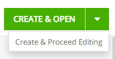
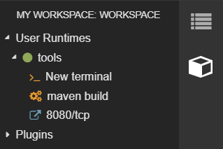

# Rakuten-kai

(English Below)

楽天短期インターンシップでは、ウェブアプリエンジニアとして企画から開発までの一連の仕事を体験させていただきました。インターン生4人とメンター2人のチームで「楽天介」というウェブアプリを開発しました。このウェブアプリは困っている外国人と助けてあげたい日本人をマッチングさせるアプリです。開発には、JavaとSpring boot, Bootstrapを使っていました。チームでは、積極的にアイデア出しに挑戦して、最後に私のアイデアが採用されました。また、フロントエンドの部分を担当しました。[ウェブアプリの動作例は下に示しています](#example-of-the-web-app)。

This is a web application that we created in Rakuten Short Internship. This web app can help foreginers by matching foreginers who need help and Japanese who want to offer help. It is like a matching app, but japanese-foreginers version! The web app was developed in Java, HTML using frameworks like Spring Boot and Bootstrap. [See more below](#example-of-the-web-app) for the example of the web app on action!

### How to create a development env on Eclipse-Che
1. Open Workspaces page in Eclipse Che
2. Click "Add Workspace" button, then it New Workspace page appears
3. Click "Create & Proceed Editing" (at next triangle mark next to "CREATE & OPEN" button), then Workspaces page appears  

4. Click "Devfile" tab, and paste [rakutenkai-presentation.json](doc/rakutenkai-presentation.json) into "Workspace" textarea, after that "Success" message appears
5. Click "Open", then a workspace opens
6. Click "View" -> "My Workspace" on the menu, then "MY WORKSPACE" appears

7. Click "maven build", then the rakutenkai project will be built
8. Click "8080/tcp", then a instant server page appears
9. Get IP addresses of the instant server, and register them into a white-list of Geolocation API (ipinfodb.com)

### Example of the web app

Homepage

Search Result

User Profile

Messaging 

User's Appointment list

